<h1 align="center">
  
</h1>

<h4 align="center">
  Happy :construction: In progress :construction:
</h4>
<p align="center">
  

  
  
  <a href="https://github.com/gagigante/happy-nlw3/commits/master">
    
  </a>

  <a href="https://github.com/gagigante/happy-nlw3/issues">
    
  </a>

  

<p align="center">
  <a href="#octocat-roadmap">Roadmap</a>&nbsp;&nbsp;&nbsp;|&nbsp;&nbsp;&nbsp;
   <a href="#rocket-technologies">Technologies</a>&nbsp;&nbsp;&nbsp;|&nbsp;&nbsp;&nbsp;
    <a href="#label-layout">Layout</a>&nbsp;&nbsp;&nbsp;|&nbsp;&nbsp;&nbsp;
  <a href="#computer-project">Project</a>&nbsp;&nbsp;&nbsp;|&nbsp;&nbsp;&nbsp;
  <a href="#runner-how-to-run">How to run</a>&nbsp;&nbsp;&nbsp;|&nbsp;&nbsp;&nbsp;
  <a href="#-how-to-contribute">How to contribute</a>&nbsp;&nbsp;&nbsp;|&nbsp;&nbsp;&nbsp;
  <a href="#memo-license">License</a>
</p>

<br>

<p align="center">
 
  
</p>

## :octocat: Roadmap

- Day 1: Acelerando sua evolução 12/10 - :heavy_check_mark:
- Day 2: Olhando as oportunidades 13/10 - :heavy_check_mark:
- Day 3: A escolha da Stack 14/10 - :construction:
- Day 4: Até 2 anos em 2 meses 15/10 - :construction:
- Day 5: Milha extra 16/10 - :construction:

## :rocket: Technologies

This project was developed with the following techs:

- [Node](https://nodejs.org/en/)
- [React](https://reactjs.org/)
- [React Native](https://reactnative.dev/)
- [TypeScript](https://www.typescriptlang.org/)


## :label: Layout

Access project layout [here](https://www.notion.so/Layout-Happy-OmniStack-faac4d4d638343fe8bab627125a7557c)

## :computer: Project

Happy is a project created to celebrate children's day. This application helps people to find orphanages to visit.

## :runner: How to run

<br/>

### Backend

<br/>

#### API Reference: 
[](https://insomnia.rest/run/?label=NLW%203&uri=https%3A%2F%2Fraw.githubusercontent.com%2Fgagigante%2Fhappy-nlw3%2Fmaster%2Fbackend%2Fdocs%2Fapi-reference.json)

Access `backend` folder and install the dependencies
```
  $ yarn

  # or

  $ npm install
```

After that run the database migrations
```
  $ yarn typeorm migration:run

  # or

  $ npm typeorm migration:run
```

Finally start the server
```
  $ yarn dev

  # or

  $ npm dev
```

<br/>

### Frontend

Access `web` folder and install the dependencies
```
  $ yarn

  # or

  $ npm install
```

After that start the server
```
  $ yarn start

  # or

  $ npm start
```

## 🤔 How to contribute

- Fork this repo;
- Create a branch for your new feature: `git checkout -b my-feature`;
- Commit your changes: `git commit -m 'feat: My brand new feature'`;
- Push it to your branch: `git push origin my-feature`.

After merge of your pull request, you can delete your branch.

## :memo: License

This project is under MIT license. See the file [LICENSE](LICENSE) for details.

---